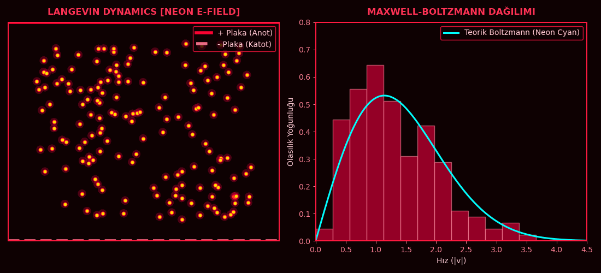

## Langevin Dynamics [Neon E-Field] - Maxwell-Boltzmann Validation



Stochastic simulation of 160 charged particles under an external electric field using Langevin dynamics.

**Left:** 2D particle chamber with thermal fluctuations (ξ), drag (γ), gravity (g) and E-field drift.  
**Right:** Real-time speed histogram vs. theoretical Maxwell-Boltzmann distribution `f(v) ~ v * exp(-v² / 2kT)`.

Built with Python / NumPy / Matplotlib. Euler-Maruyama integration.

Run:
```bash
pip install numpy matplotlib
python Langevin_Dynamics_Maxwell-Boltzmann.py


# Langevin Dynamics & Maxwell-Boltzmann Distribution

A 2D neon Langevin simulation of charged particles in an electric field with thermal fluctuations and dynamic Maxwell-Boltzmann velocity fitting.


cat << 'EOF' > README.md
# Langevin Dynamics & Maxwell-Boltzmann (Neon Red)

Real-time 2D Langevin dynamics simulation written in Python. Solves Brownian motion with thermal noise, drag, and an electric field, demonstrating an emergent Maxwell-Boltzmann velocity distribution.


## Run Directly from Terminal

Navigate to the project directory and run:

```bash
pip install numpy matplotlib
python boltzmann_neon.py


Physics & Features
Langevin SDE: Solved numerically via the Euler-Maruyama method.
Fluctuation-Dissipation: Thermal noise balanced against viscous drag.
Live Stats: Real-time speed histogram fitted against the 2D Maxwell-Boltzmann distribution.
Theme: Cyberpunk dark-neon aesthetic in Matplotlib.
